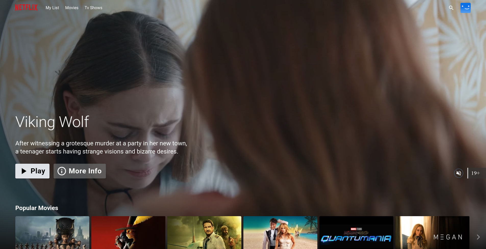

<div align="center">
  <a href="http://netflix-clone-with-tmdb-using-react-mui.vercel.app/">
    
  </a>

  <h3 align="center">Netflix Clone</h3>

  <p align="center">
    <a href="https://netflix-clone-react-typescript.vercel.app/">View Demo</a>
    ·
    <a href="https://github.com/crazy-man22/netflix-clone-react-typescript/issues">Report Bug</a>
    ·
    <a href="https://github.com/crazy-man22/netflix-clone-react-typescript/issues">Request Feature</a>
  </p>
</div>

<details>
  <summary>Table of Contents</summary>
  <ol>
    <li>
      <a href="#prerequests">Prerequests</a>
    </li>
    <li>
      <a href="#which-features-this-project-deals-with">Which features this project deals with</a>
    </li>
    <li><a href="#third-party-libraries-used-except-for-react-and-rtk">Third Party libraries used except for React and RTK</a></li>
    <li>
      <a href="#contact">Contact</a>
    </li>
  </ol>
</details>

<br />

<div align="center">
  
  <p align="center">Home Page</p>
  
  <p align="center">Mini Portal</p>
  
  <p align="center">Detail Modal</p>
  
  <p align="center">Grid Genre Page</p>
  
  <p align="center">Watch Page with customer contol bar</p>
</div>

## Prerequests

- Create an account if you don't have on [TMDB](https://www.themoviedb.org/).
  Because I use its free API to consume movie/tv data.
- And then follow the [documentation](https://developers.themoviedb.org/3/getting-started/introduction) to create API Key
- Finally, if you use v3 of TMDB API, create a file named `.env`, and copy and paste the content of `.env.example`.
  And then paste the API Key you just created.

## Which features this project deal with

- How to create and use [Custom Hooks](https://reactjs.org/docs/hooks-custom.html)
- How to use [Context](https://reactjs.org/docs/context.html) and its provider
- How to use lazy and Suspense for [Code-Splitting](https://reactjs.org/docs/code-splitting.html)
- How to use a new [lazy](https://reactrouter.com/en/main/route/lazy) feature of react-router to reduce bundle size.
- How to use data [loader](https://reactrouter.com/en/main/route/loader) of react-router, and how to use redux dispatch in the loader to fetch data before rendering component.
- How to use [Portal](https://reactjs.org/docs/portals.html)
- How to use [Fowarding Refs](https://reactjs.org/docs/forwarding-refs.html) to make components reusuable
- How to create and use [HOC](https://reactjs.org/docs/higher-order-components.html)
- How to customize default theme of [MUI](https://mui.com/)
- How to use [RTK](https://redux-toolkit.js.org/introduction/getting-started)
- How to use [RTK Query](https://redux-toolkit.js.org/rtk-query/overview)
- How to customize default classname of [MUI](https://mui.com/material-ui/experimental-api/classname-generator)
- Infinite Scrolling(using [Intersection Observer API](https://developer.mozilla.org/en-US/docs/Web/API/Intersection_Observer_API))
- How to make awesome carousel using [slick-carousel](https://react-slick.neostack.com)

## Third Party libraries used except for React and RTK

- [react-router-dom@v6.9](https://reactrouter.com/en/main)
- [MUI(Material UI)](https://mui.com/)
- [framer-motion](https://www.framer.com/docs/)
- [video.js](https://videojs.com)
- [react-slick](https://react-slick.neostack.com/)

## Install with Docker

```sh
docker build --build-arg TMDB_V3_API_KEY=your_api_key_here -t netflix-clone .

docker run --name netflix-clone-website --rm -d -p 80:80 netflix-clone
```

## Todo

- Make the animation of video card portal more similar to Netflix.
- Improve performance. I am using `context` and `provider` but all components subscribed to the context's value are re-rendered. These re-renders happen even if the part of the value is not used in render of the component. there are [several ways](https://blog.axlight.com/posts/4-options-to-prevent-extra-rerenders-with-react-context/) to prevent the re-renders from these behaviours. In addition to them, there may be several performance issues.
- Replace bundler([Vite](https://vitejs.dev/guide)) with [Turbopack](https://turbo.build/pack/docs/why-turbopack). Turbopack is introduced in Next.js conf recently. It's very fast but it's nor ready to use right now. it just support Next.js, and they plan to support all others as soon as possible. so if it's ready to use, replace [Vite](https://vitejs.dev/guide) with [Turbopack](https://turbo.build/pack/docs/why-turbopack).
- Add accessibilities for better UX.
- Add Tests.
# Netflix-clone
# Netflix-clone


# Deploying a Netflix's clone project using GitHub actions (CI/CD)

# Step - 1 Git Repository

     - https://github.com/tohidhanfi20/Netflix-clone

# Step - 2 Requirements

     - Instance : Ubuntu (AMI — 0c7217cdde317cfec)
     - Instance Type : T2.medium
     - storage : 8gb
image


# Step - 3 Install Docker and Run Sonarqube Container

    - sudo apt-get update
      sudo apt install docker.io -y
      sudo usermod -aG docker ubuntu
      newgrp docker
      sudo chmod 777 /var/run/docker.sock

iamge
      
# Step - 4 Run the SonarQube Docker image 

    - docker run -d --name sonar -p 9000:9000 sonarqube:lts-community


  iamge

After installing the Sonarqube to access that u have to open tha 9000 port in security groups.

image

# Step - 5 

To login to the page copy the IP Address and 9000 to access the sonarqube page

    - <ec2-public-ip:9000>

image

# Step - 6 

login to the page

    -  user name : admin
       password : admin

you will change the password after login save & remember it.

Once you login the SonarQube page will appear like this.

image

# Step - 7 Integrating SonarQube with GitHub Actions

When you integrate SonarQube with GitHub Actions, you can automatically assess your code for quality and security as part of your continuous integration process.

We already have SonarQube up and running

To add a GitHub Action to SonarQube, go to the Dashboard and choose Manually.

iamge

Next, give your project a name and a branch name, then click setup.
 
image

We need to examine your repository for CI Process, thus we’ll use GitHub Actions.

image

This will provide an overview of the project as well as some integration instructions.

image 

Open GitHub, choose your repository, and then click Settings.

image

Search for Secrets and variables and click on and again click on actions and click on New Repository secret

Image

Now go back to Your SonarQube Dashboard

copy the Name : SONAR_TOKEN paste it — Actions secrets / New secret

Click on Generate a Token

image 

image

After generating the token code save it in the GitHub actions

Again Click on the New Repository Secret and add SonarQube Host URL in GitHub

image 

image

image

Go to SonarQube Dashboard and click continue

Select the workflow of the yaml file. It means the application was designed in JS so we have selected JS.

follow the instructions care full and add then in the GitHub Repository

image

Got To GitHub Repository and create a sonar-project.properties file and add the content in to it.

File name

      - sonar-project.properties

content to be added to the file

      - sonar.projectKey=Netflix

image

We need to add our workflow

For that click on Add file and then click on Create a new file

file name

      - .github/workflows/build.yml

Content to be added in the file (build.yml)

      - name: Build
        on:
         push:
          branches:
           - main


       jobs:
        build:
          name: Build
          runs-on: ubuntu-latest
          steps:
           - uses: actions/checkout@v2
             with:
               fetch-depth: 0  # Shallow clones should be disabled for a better relevancy of analysis
           - uses: sonarsource/sonarqube-scan-action@master
             env:
               SONAR_TOKEN: ${{ secrets.SONAR_TOKEN }}
               SONAR_HOST_URL: ${{ secrets.SONAR_HOST_URL }}
            # If you wish to fail your job when the Quality Gate is red, uncomment the
            # following lines. This would typically be used to fail a deployment.
            # - uses: sonarsource/sonarqube-quality-gate-action@master
            #   timeout-minutes: 5
            #   env:
            #     SONAR_TOKEN: ${{ secrets.SONAR_TOKEN }}

  image

  image

  Now it will be automatically started the workflow

  image

  Let’s go ahead and select Build to see what steps are involved.

  image

  Go to the SonarQube dashboard and click on projects and you can see the analysis

  image

  # Let’s scan files using Trivy

  Add this code to your build.yml and Commit changes.

      - - name: install trivy
          run: |
            #install trivy
            sudo apt-get install wget apt-transport-https gnupg lsb-release -y
            wget -qO - https://aquasecurity.github.io/trivy-repo/deb/public.key | gpg --dearmor | sudo tee /usr/share/keyrings/trivy.gpg > /dev/null
            echo "deb [signed-by=/usr/share/keyrings/trivy.gpg] https://aquasecurity.github.io/trivy-repo/deb $(lsb_release -sc) main" | sudo tee -a 
            /etc/apt/sources.list.d/trivy.list
            sudo apt-get update
            sudo apt-get install trivy -y
            #command to scan files
            trivy fs .
            

   Make Sure to follow the alignments while creating build.yml script

   image

   Once Commit the changes.the build will started automatically.

   image

   After build successful we can see Trivy has Installed.

   image

   # Docker build and push to Dockerhub

   For your Dockerhub account, create a Personal Access token.

   Navigate to Docker Hub and choose your profile Account settings Security New access token

   image

   Image

   It will ask us to Provide access Token Description use Netflix

   image

   Copy the token save it in a safe place, and close

  Now Go to GitHub again and click on settings , Search for Secrets and variables and click on it and again click on actions and again click on new repository 
  secrets.

  Add your Docker hub username in secret name section

      - DOCKERHUB_USERNAME   #use your dockerhub username

 image

 Let’s add our Docker Hub token also and click on the new repository secret again

     - DOCKERHUB_TOKEN #add you save Docker Hub Token

 image

 after adding you can see 4 action secrets

 image

 # Create a TMDB API Key

 If you didn’t created TMDB Account create an account and follow below steps

 image

 To create API Request go to settings → API → create → Developer

add few details and accept all the terms and conditions, once submitted you will get API Key

image

Let’s add the below step to the workflow, You have to add APIKey to the Build command and Change your username also.

     -  name: Docker build and push
        run: |
            #run commands to build and push docker images
            docker build --build-arg TMDB_V3_API_KEY=<APIKEY> -t netflix .
            docker tag netflix <DOCKERHUB_USERNAME>/netflix:latest
            docker login -u ${{ secrets.DOCKERHUB_USERNAME }} -p ${{ secrets.DOCKERHUB_TOKEN }}
            docker push <DOCKERHUB_USERNAME>/netflix:latest
        env:
            DOCKER_CLI_ACI: 1

 image 

 image

 # Add a self-hosted runner to EC2

 Go to GitHub and click on Settings → Actions → Runners

 image

 click on New self-hosted runner → Linux → Architecture

run the commands in the EC2 Instance for connection between GItHub and EC2

# Downloads

     - # Create a folder
         mkdir actions-runner && cd actions-runner

      # Download the latest runner package
        curl -o actions-runner-linux-x64-2.311.0.tar.gz -L https://github.com/actions/runner/releases/download/v2.311.0/actions-runner-linux-x64-2.311.0.tar.gz

      # Optional: Validate the hash
        echo "29fc8cf2dab4c195bb147384e7e2c94cfd4d4022c793b346a6175435265aa278  actions-runner-linux-x64-2.311.0.tar.gz" | shasum -a 256 -c

      # Extract the installer
        tar xzf ./actions-runner-linux-x64-2.311.0.tar.gz

  image

     # Create the runner and start the configuration experience
     ./config.sh --url https://github.com/himapandu/Netflix-clone --token A24KZYJH3ZH4CF5HN4VR4JDFQPXWI

Press enter when it display to enter it means it will take default

image

     - # Last step, run it!
       ./run.sh

image

after seeing this got to git hub and u can check the status of the runner

image

# Final workflow to run the container

Let’s add a deployment workflow

     - deploy:    
         needs: build  
         runs-on: [aws-netflix]  
         steps:
           - name: Pull the docker image
             run: docker pull <DOCKERHUB_USERNAME>/netflix:latest
           - name: Trivy image scan
             run: trivy image <DOCKERHUB_USERNAME>/netflix:latest
           - name: Run the container netflix
             run: docker run -d --name netflix -p 8081:80 <DOCKERHUB_USERNAME>/netflix:latest

  # Using your self-hosted runner

        - # Use this YAML in your workflow file for each job
            runs-on: self-hosted

            
1.deploy:: This is the name of a workflow or job, likely associated with a CI/CD pipeline. It specifies what should happen when this deployment job is triggered.

2. needs: build-analyze-scan: This line indicates that this deployment job depends on the successful completion of a previous job named "build-analyze-scan." In other words, it waits for "build-analyze-scan" to finish before starting.

3. runs-on: [aws-netflix]: This job is set to run on a specific type of runner or environment, labeled as "aws-netflix." Runners are the environments where jobs are executed, and "aws-netflix" suggests that this deployment might be intended for an AWS-based infrastructure.

4. steps:: This section lists the individual steps or tasks to be executed as part of the deployment job.
   
5. name: Pull the docker image: This step has a descriptive name. It uses the docker pull command to fetch a Docker image labeled "<DOCKERHUB_USERNAME>/netflix:latest." This is a common step in container-based deployments, where it ensures that the latest version of the Docker image is available locally.
   
6. name: Trivy image scan: This step performs a security scan on the Docker image "<DOCKERHUB_USERNAME>/netflix:latest" using a tool called Trivy. Trivy is used for vulnerability scanning of container images.

7. name: Run the container netflix: This step starts a Docker container named "netflix" using the image "<DOCKERHUB_USERNAME>/netflix:latest." It runs the container in detached mode ("-d") and maps port 8081 on the host to port 80 in the container, making the service accessible via port 8081 on the host.
   
This workflow is intended to automate the deployment of a Docker container, including checks for the most recent image, a security scan, and container launch. This task is supposed to be done on the given runner, presumably in an AWS environment, and its success is dependent on the performance of the previous “build-analyze-scan” job.

Commit changes

You will see two different Jobs now click on build and see the process.

image

image

Now come back by clicking on Summary and click on Deploy now

It starts running the job on your EC2 instance

while deploying if u facing the issue like this

image

# Install Trivy manually in EC2

     - #install trivy
       sudo apt-get install wget apt-transport-https gnupg lsb-release -y
       wget -qO - https://aquasecurity.github.io/trivy-repo/deb/public.key | gpg --dearmor | sudo tee /usr/share/keyrings/trivy.gpg > /dev/null
       echo "deb [signed-by=/usr/share/keyrings/trivy.gpg] https://aquasecurity.github.io/trivy-repo/deb $(lsb_release -sc) main" | sudo tee -a 
       /etc/apt/sources.list.d/trivy.list
       sudo apt-get update
       sudo apt-get install trivy -y

 image

 image

 and go to build.yml file and commit the file again u can see the successful build and can access NETFLIX’s Clone Website.

      - <IP_Address:8081>

 You will see Netflix web application will run

 image

 image

 image

 # FULL WORKFLOW (Build.yml)

      name: Build

      on:
        push:
          branches:
            - main
 

      jobs:
        build:
          name: Build
          runs-on: ubuntu-latest
          steps:
            - uses: actions/checkout@v2
              with:
                fetch-depth: 0  # Shallow clones should be disabled for a better relevancy of analysis
            - uses: sonarsource/sonarqube-scan-action@master
              env:
                SONAR_TOKEN: ${{ secrets.SONAR_TOKEN }}
                SONAR_HOST_URL: ${{ secrets.SONAR_HOST_URL }}
            # If you wish to fail your job when the Quality Gate is red, uncomment the
            # following lines. This would typically be used to fail a deployment.
            # - uses: sonarsource/sonarqube-quality-gate-action@master
            #   timeout-minutes: 5
            #   env:
            #     SONAR_TOKEN: ${{ secrets.SONAR_TOKEN }}
            - name: install trivy
              run: |
                  #install trivy
                  sudo apt-get install wget apt-transport-https gnupg lsb-release -y
                  wget -qO - https://aquasecurity.github.io/trivy-repo/deb/public.key | gpg --dearmor | sudo tee /usr/share/keyrings/trivy.gpg > /dev/null
                  echo "deb [signed-by=/usr/share/keyrings/trivy.gpg] https://aquasecurity.github.io/trivy-repo/deb $(lsb_release -sc) main" | sudo tee -a 
                  /etc/apt/sources.list.d/trivy.list
                  sudo apt-get update
                  sudo apt-get install trivy -y
                  #command to scan files
                  trivy fs .
            - name: Docker build and push
              run: |
                  #run commands to build and push docker images
                  docker build --build-arg TMDB_V3_API_KEY=f0f77600ea50d1cb6fb39e6513cceb8f -t netflix .
                  docker tag netflix tohidaws/netflix:latest
                  docker login -u ${{ secrets.DOCKERHUB_USERNAME }} -p ${{ secrets.DOCKERHUB_TOKEN }}
                  docker push tohidaws/netflix:latest
              env:
                  DOCKER_CLI_ACI: 1
    deploy:    
      needs: build  
      #runs-on: [aws-netflix] 
      runs-on: self-hosted
      steps:
        - name: Pull the docker image
          run: docker pull tohidaws/netflix:latest
        - name: Trivy image scan
          run: trivy image tohidaws/netflix:latest
        - name: Run the container netflix
          run: docker run -d --name netflix -p 8081:80 tohidaws/netflix:latest

  
